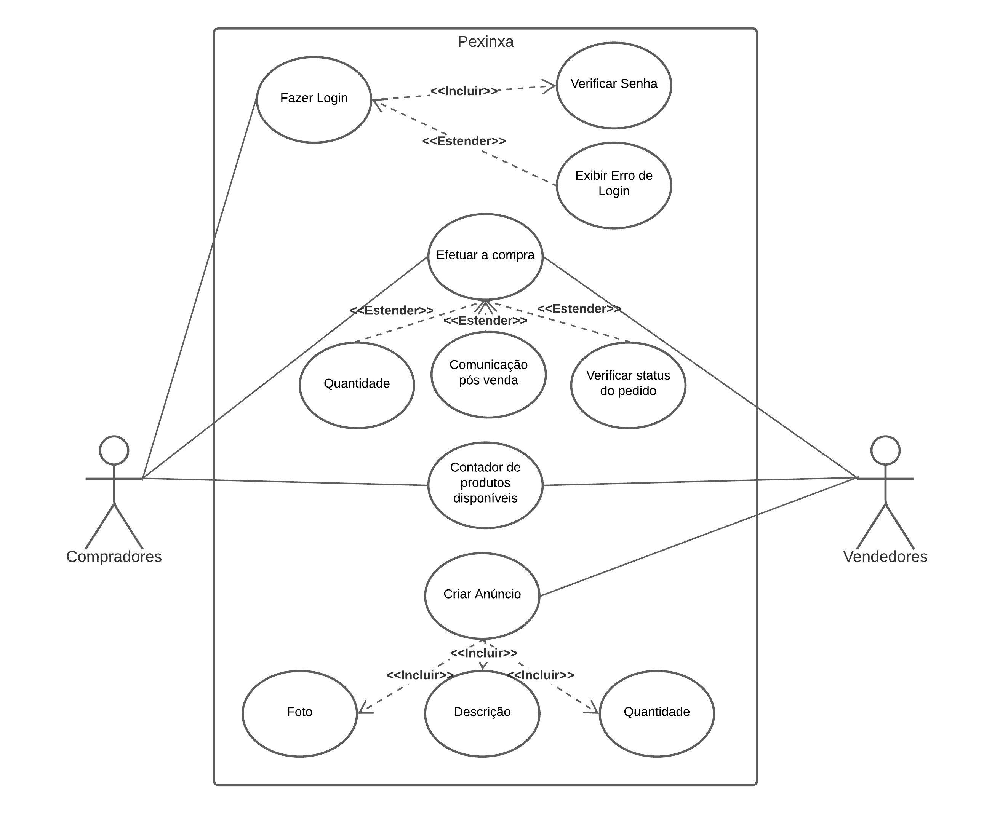
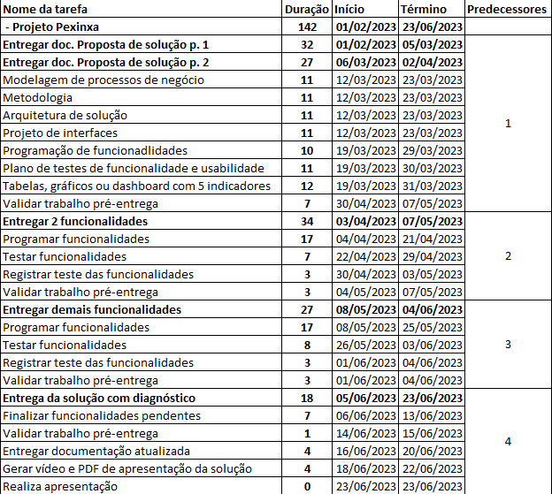
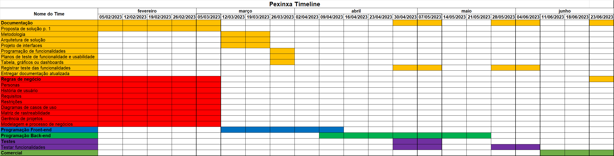
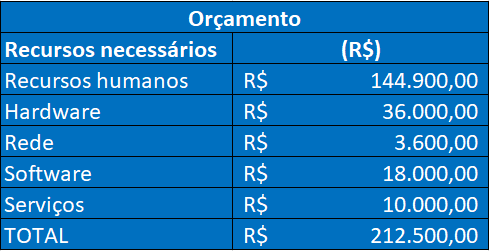

# Especificações do Projeto

Pré-requisitos: <a href="01-Documentação de Contexto.md"> Documentação de Contexto</a>

A definição exata do problema e os pontos mais relevantes a serem tratados neste projeto foi consolidada com a participação dos usuários em um trabalho de imersão feita pelos membros da equipe a partir da observação dos usuários em seu local natural e por meio de entrevistas. Os detalhes levantados nesse processo foram consolidados na forma de personas e histórias de usuários. 
 
## Personas

As personas levantadas durante o processo de entendimento do problema são apresentadas na Figuras que se seguem. 
  
<table>
 <tbody>
  <tr>
   <td rowspan="3"></td>
   <td colspan="3"><strong> Kellen Araújo</strong></td>
  </tr>
  
  <tr>
   <td>43 Anos</td>
   <td>Timóteo </td>
   <td>Artesã</td>
  </tr>
  
  <tr>
   <td colspan="3">
    <strong>Personalidade</strong>: Prestativa, detalhista e dedicada
   </td>
  </tr>
  
  <tr>
   <td colspan="4">
    <strong>Biografia</strong>: Decidiu não cursar a faculdade para se dedicar a sua paixão, que é costurar. Montou em sua casa uma pequena atelie e fabrica vários tipos de roupas para vender. Não é sempre que ela vende na sua localidade todas as peças de roupas que produz e gostaria de vender seus produtos online. Sem muito conhecimento nessa área, ela não se arrisca a anunciar em alguns sites por serem complicados demais.
   </td>
  </tr>
  
  <tr>
   <td colspan="4">
    <strong>Objetivos</strong>:  Ter um site com um sistema simplificado para poder anunciar a sua mercadoria e aumentar a sua venda além de sua localidade.
   </td>
  </tr>
  
  <tr>
   <td colspan="4">
    <strong>Pontos de dor e frustração</strong>: Dificuldade de encontrar uma aplicação onde seja simples e barato para ela utilizar sem dificuldades
   </td>
  </tr>
  
  <tr>
   <td colspan="4">
    <strong>Necessidades e expectativas</strong>: Abrir uma conta virtual em um site de vendas para vender os seus produtos para além de sua localidade.
   </td>
  </tr>
 </body>
<table>
 
 
 
 <table>
 <tbody>
  <tr>
   <td rowspan="3"></td>
   <td colspan="3"><strong>Regina Costa</strong></td>
  </tr>

  <tr>
   <td>28 Anos</td>
   <td>Belo Horizonte</td>
   <td>Geógrafa</td>
  </tr>

  <tr>
   <td colspan="3">
    <strong>Personalidade</strong>: Focada, comunicativa e compreensiva.
   </td>
  </tr>

  <tr>
   <td colspan="4">
    <strong>Biografia</strong>: Géografa formada pela PUC Minas, trabalha em uma empresa de geoprocessamento. Adora estudar, buscar e compartilhar conhecimentos. Amante de trilhas, escaladas e esportes de aventura no geral.
   </td>
  </tr>

  <tr>
   <td colspan="4">
    <strong>Objetivos</strong>: Ter um aplicativo no qual ela possa encontrar uma variedade de pequenas empresas, que seja possível comparar os preços e especificações dos produtos buscados.
   </td>
  </tr>

  <tr>
   <td colspan="4">
    <strong>Pontos de dor e frustração</strong>: Aplicativos que não verificam a veracidade dos anunciantes, na tentativa de evitar possíveis golpes, além da complexidade em suas funções.
   </td>
  </tr>

  <tr>
   <td colspan="4">
    <strong>Necessidades e expectativas</strong>: Encontrar um aplicativo simples, de fácil utilização e intuitivo, que filtre por produtos semelhantes, preço e demais atributos.
   </td>
  </tr>
 </body>
<table>
 
 <table>
 <tbody>
  <tr>
   <td rowspan="3"></td>
   <td colspan="3"><strong>Carlos Alberto</strong></td>
  </tr>

  <tr>
   <td>42 Anos</td>
   <td>Belo Horizonte</td>
   <td>Desempregado</td>
  </tr>

  <tr>
   <td colspan="3">
    <strong>Personalidade</strong>: Sonhador, determinado e comunicativo.
   </td>
  </tr>

  <tr>
   <td colspan="4">
    <strong>Biografia</strong>: Já teve diversos empregos porém encontra dificuldades em ficar em um emprego por muito tempo. Pois sempre sonhou em ter uma formação em administração e ter seu próprio negócio.
   </td>
  </tr>

  <tr>
   <td colspan="4">
    <strong>Objetivos</strong>: Começar seu empreendimento simples onde consiga dar seus primeiros passos.
   </td>
  </tr>

  <tr>
   <td colspan="4">
    <strong>Pontos de dor e frustração</strong>: Aplicativos onde ja há possuem monopólios e não ajudam empreendimentos novos.
   </td>
  </tr>

  <tr>
   <td colspan="4">
    <strong>Necessidades e expectativas</strong>: Um aplicativo que seja igualitário e dê oportunidade a todos.
   </td>
  </tr>
 </body>
<table>
 
 <table>
 <tbody>
  <tr>
   <td rowspan="3"></td>
   <td colspan="3"><strong> Raphael Costa</strong></td>
  </tr>
  
  <tr>
   <td>31 Anos</td>
   <td>São Paulo </td>
   <td>Empresário</td>
  </tr>
  
  <tr>
   <td colspan="3">
    <strong>Personalidade</strong>: Comunicativo, dedicado e esforçado.
   </td>
  </tr>
  
  <tr>
   <td colspan="4">
    <strong>Biografia</strong>: Atualmente trabalha em sua loja, não possui formação acadêmica, adora ler sobre economia para tentar alavancar seu negócio.
   </td>
  </tr>
  
  <tr>
   <td colspan="4">
    <strong>Objetivos</strong>:  Ter acesso a um aplicativo no qual facilitará a venda de seus produtos de forma fácil e direta com o consumidor.
   </td>
  </tr>
  
  <tr>
   <td colspan="4">
    <strong>Pontos de dor e frustração</strong>: Dificuldade de verificar seus produtos anunciados e as vendas efetuadas por meio de aplicativos de conversa online.
   </td>
  </tr>
  
  <tr>
   <td colspan="4">
    <strong>Necessidades e expectativas</strong>: Encontrar um aplicativo de fácil interação, para assim, facilitar os processos de anúncio e vendas de seus produtos.
   </td>
  </tr>
 </body>
<table>

## Histórias de Usuários

A partir da compreensão do dia a dia das personas identificadas para o projeto, foram registradas as seguintes histórias de usuários. 

|EU COMO... `PERSONA`| QUERO/PRECISO ... `FUNCIONALIDADE`                                 |PARA ... `MOTIVO/VALOR`                                              |
|--------------------|--------------------------------------------------------------------|---------------------------------------------------------------------|
|Kellen Araújo       | Uma aplicação simples de mexer                                     | Colocar sua mercadoria a venda online                               |
|Kellen Araújo       | Poder colocar um limite de quantidade de produtos disponíveis      | Não vender mais do que tem em estoque ou sua capacidade de produzir |
|Regina Costa        | Poder filtrar os produtos por preço, tipo, etc                     | Ajudar na decisão de compra                                         |
|Regina Costa        | Ter um feedback de antigos compradores                             | Ter mais confiança na qualidade do produto e no anunciante          |
|Carlos Alberto      | Um aplicativo que dê feedback sobre seu estabelecimento            | Conseguir identificar como está gerenciando seu negócio             |
|Carlos Alberto      | Ter contato com os administradores                                 | Ter a segurança de que há um canal de comunicação no caso de problemas |
|Raphael Costa       | Poder editar dados dos produtos anunciados.                        | Realizar alterações de dados de produtos.                           |

## Requisitos

O escopo funcional do projeto é definido por meio dos requisitos funcionais que descrevem as possibilidades interação dos usuários, bem como os requisitos não funcionais que descrevem os aspectos que o sistema deverá apresentar de maneira geral. Estes requisitos são apresentados a seguir. 

### Requisitos Funcionais
 
|ID&nbsp;&nbsp;&nbsp;&nbsp;&nbsp;&nbsp;&nbsp;&nbsp;&nbsp;&nbsp;     | Descrição do Requisito  | Prioridade |
|-------|-----------------------------------------|----|
|RF-01  | A aplicação deve apresentar a funcionalidade de buscador (search)    | Alto |
|RF-02  | A aplicação deve apresentar categorias de produtos para facilitar a busca dos usuários | Alto |
|RF-03  | A aplicação deve apresentar mecanismos para avaliação dos estabelecimentos através de comentário e notas | Médio |
|RF-04  | A aplicação deve possuir um filtro para refinar a busca do usuário | Médio |
|RF-05  | A aplicação deve possuir uma área de login para que o usuário possa fazer suas compras | Alta |
|RF-06  | A aplicação deve possuir uma área de login para as vendedores fazer a gestão de suas vendas | Alta |
|RF-07  | A aplicação deve possuir uma área para cadastrar novos usuários e vendedores | Alta |
|RF-08  | A aplicação deve possuir dentro da área de login da vendedores um resumo de feedback dos usuários | Baixo |
|RF-09  | A aplicação deve possuir um mecanismo de inclusão dos produtos disponívies dos vendedores | Alta |
|RF-10  | A aplicação deve possuir um local de perguntas e resposta na descrição do produto | Baixa |
|RF-11  | A aplicação deve possuir um canal de comunicação entre compradores e vendedores para pós venda | Meédia |
|RF-12  | A aplicação deve possuir um canal de comunicação direto com os administradores dentro da área de login de usuários | Média |
|RF-13  | A aplicação deve mostrar uma tela onde o cliente conseguirá visualizar o status do pedido | Alta |
|RF-14  | A aplicação deve permitir a edição dos dados do anúncio | Alta |
|RF-15  | A aplicação deve possuir um sacola de compra | Baixa |
 
 
### Requisitos não Funcionais
 
| ID&nbsp;&nbsp;&nbsp;&nbsp;&nbsp;&nbsp;&nbsp;&nbsp;&nbsp;&nbsp;        | Descrição do Requisito  |Prioridade |
|-----------|-------------------------|----|
|RNF-01     | O aplicativo deve ser responsivo | Alta |
|RNF-02     |	O aplicativo deve ser compatível com os principais sistemas operacionais	| Alta |
|RNF-03	    | O aplicativo deve ter acessibilidade digital, seguindo as regras da WCAG 2.1 conforme normas da W3C	| Média |
|RNF-04     | O sistema deve ser responsivo e adaptável a resoluções menores que 768px de largura | ALTA |
|RNF-05     | O sistema deve ser fácil de usar e entender | ALTA |
|RNF-06     | O sistema deve estar disponível quando necessário | ALTA |
 

## Restrições

O projeto está restrito pelos itens apresentados na tabela a seguir.

|ID| Restrição                                             |
|-----|-------------------------------------------------------|
|RE-01| A equipe não pode subcontratar o desenvolvimento do trabalho |
|RE-02| O projeto deverá ser entregue no final do semestre letivo |
|RE-03| A aplicação só poderá ser lançado se os requisitos de funcionalidade e acessibilidade quando forem atendidas |
|RE-04| A apliação será desenvolvida na linguagem React |

 
 ## Diagramas de Casos de Uso
 
 Os casos de uso devem representar as interações dos atores com o sistema, cada tipo é representado por uma forma oval rotulada e as relações são indicadas por linhas que podem ter setas nos casos em que se indica a origem da interação. Os nomes dos casos de uso devem representar verbos no infinitivo de acordo com os objetos que se relacionam os verbos. Os tipos de relacionamentos mais comuns são associações entre atores e casos de uso, generalização entre atores e entre casos de uso, inclusões e extensões entre casos de uso.
 

 
 # Matriz de Rastreabilidade
 
 Utilizada para facilitar a visualização dos relacionamentos entre os requisitos e outros artefatos do projeto, a matriz deve contemplar todos os elementos relevantes que fazem parte do sistema.
 
 # Gerenciamento de Projeto
 
 Segundo o PMBoK v6 existem dez áreas que constituem os pilares para gerenciar projetos, e que caracterizam a multidisciplinaridade envolvida, são elas: Integração, Escopo, Cronograma (Tempo), Custos, Qualidade, Recursos, Comunicações, Riscos, Aquisições, Partes Interessadas. Elas se complementam e se relacionam, de tal forma que não se deve apenas examinar uma área de forma isolada. É preciso considerar, por exemplo, que as áreas de Escopo, Cronograma e Custos estão muito relacionadas. Assim, se o escopo de um projeto é ampliado pode-se afetar seu cronograma e seus custos.
 
 ## Gerenciamento de Tempo
 
 O gerente de projetos pode utilizar desse recurso para agendar e coordenar tarefas dentro de um projeto fazendo a estimativa de tempo necessário para a conclusão.
 
<<<<<<< HEAD:Doc/02-Especificação do Projetoto.md
  
=======
  
>>>>>>> 6d69aae00cb4f279ee75e470a87ca117bf19f018:Delivery/02-Especificação do Projetoto.md
 
 ## Gerenciamento de Equipe
 
 É fundamental que ocorra a gestão de tarefas e de pessoas, de modo que os times envolvidos no projeto possam ser facilmente gerenciados.

  
 
 ## Gestão de Orçamento 
 
 O processo de determinar o orçamento do projeto é uma tarefa que depende, além dos produtos dos processos anteriores do gerenciamento de custos, também de produtos oferecidos por outros processos de gerenciamento, como o escopo e o tempo.

 
